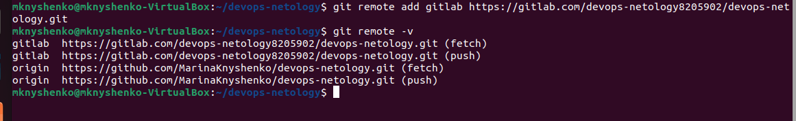

# Домашнее задание к занятию «Основы Git»

## Задание 1. Знакомимся с GitLab и Bitbucket

Создала аккаунт в Gitlab и новый публичный проект devops-netology.

Вывод команды `git remote -v` до подключения к удаленному репозиторию.

Подключаем удаденный репозиторий и выполняем push.

Вывод команды `git remote -v` после подключения к удаленному репозиторию.

## Задание 2. Теги

Создаем легковесный тег `v0.0` и пушим его в репозитории.

Создаем аннотированный тег `v0.1` и пушим его в репозитории.

Вывод команды git show будет отличаться для тегов. Для легковесного тега мы сразу увидим хеш коммита, а для аннотированного в начале будет дата и кто тегировал.

Теги в Github

Теги в Gitlab

## Задание 3. Ветки

Схема сразу после добавления ветки fix.

Схема после изменения файла в ветке fix.

Вывод команды `git log`.

## Задание 4. Упрощаем себе жизнь

