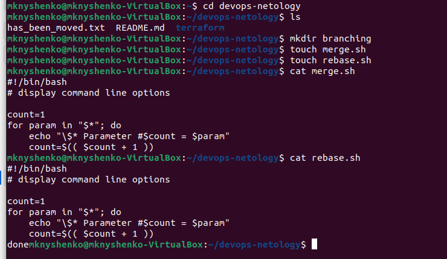
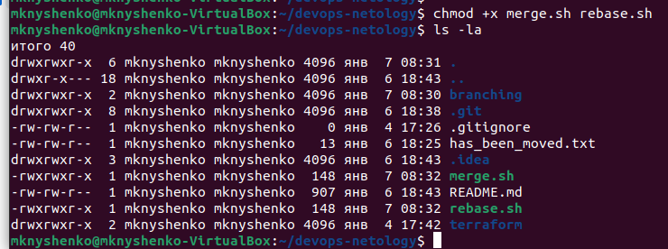
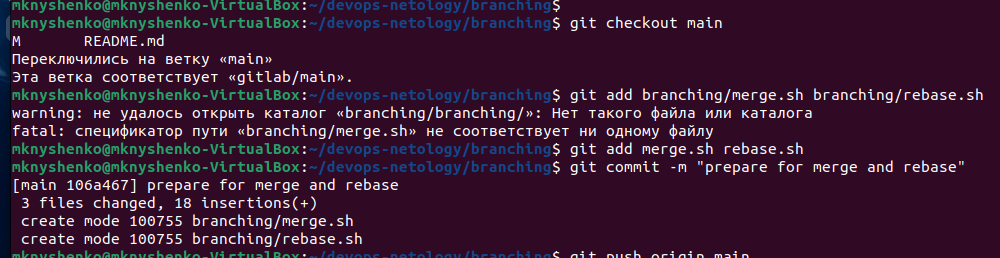
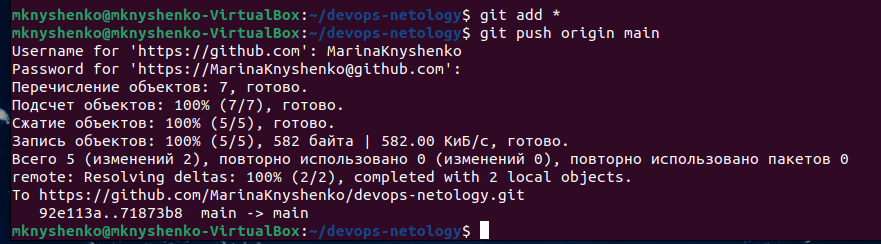
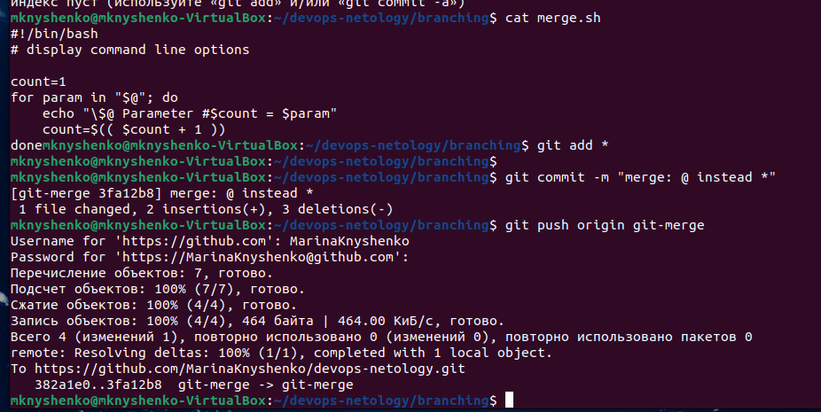
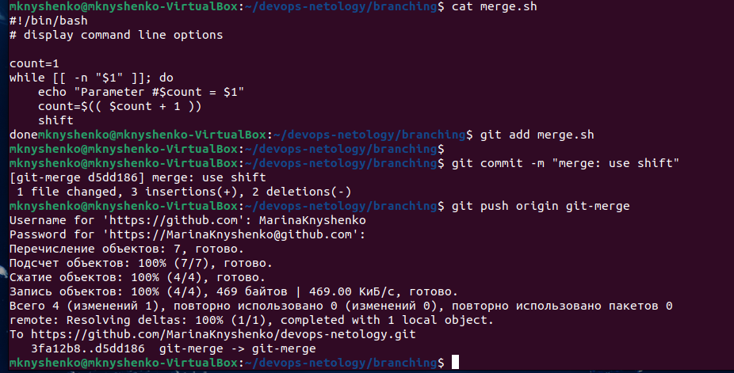
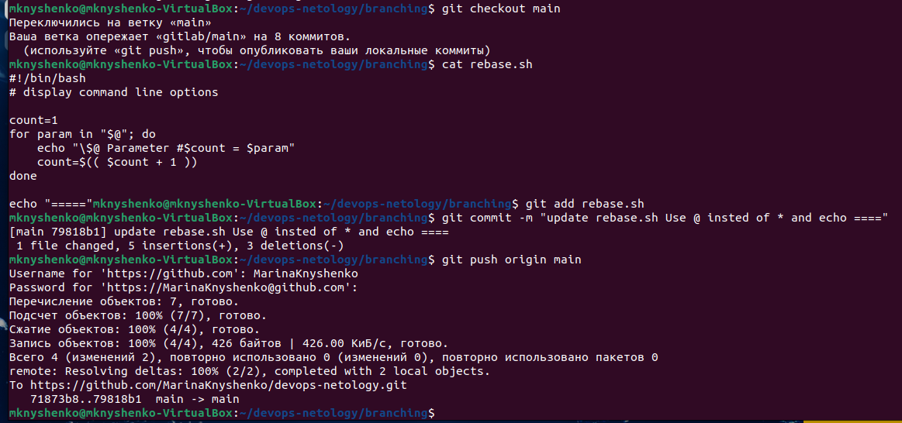
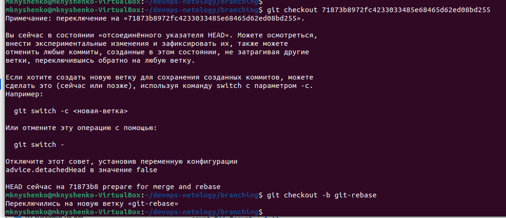
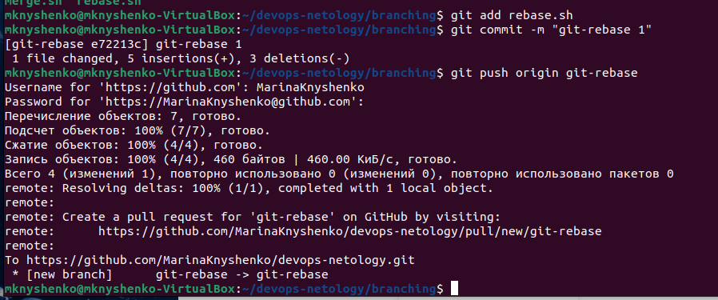
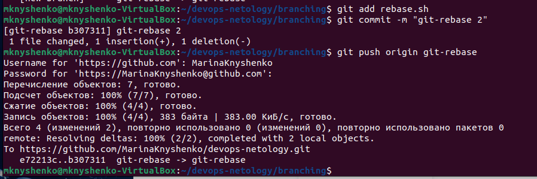

# Домашнее задание к занятию «Ветвления в Git»

## Задание «Ветвление, merge и rebase»

**Шаг 1.** Предположим, что есть задача — написать скрипт, выводящий на экран параметры его запуска. Давайте посмотрим, как будет отличаться работа над этим скриптом с использованием ветвления, merge и rebase.

Создайте в своём репозитории каталог branching и в нём два файла — merge.sh и rebase.sh — с содержимым:

```
#!/bin/bash
# display command line options

count=1
for param in "$*"; do
    echo "\$* Parameter #$count = $param"
    count=$(( $count + 1 ))
done
```

Этот скрипт отображает на экране все параметры одной строкой, а не разделяет их.

1. Создаем каталог branching и в нём два файла — merge.sh и rebase.sh



2. Делаем скрипты исполняемыми



**Шаг 2.** Создадим коммит с описанием prepare for merge and rebase и отправим его в ветку main.





### Подготовка файла merge.sh

**Шаг 1.** Создайте ветку `git-merge`.

**Шаг 2.** Замените в ней содержимое файла `merge.sh` на:

```
#!/bin/bash
# display command line options

count=1
for param in "$@"; do
    echo "\$@ Parameter #$count = $param"
    count=$(( $count + 1 ))
done
```

**Шаг 3.** Создайте коммит `merge: @ instead *`, отправьте изменения в репозиторий.



**Шаг 4.** Разработчик подумал и решил внести ещё одно изменение в `merge.sh`:

```
#!/bin/bash
# display command line options

count=1
while [[ -n "$1" ]]; do
    echo "Parameter #$count = $1"
    count=$(( $count + 1 ))
    shift
done
```

Теперь скрипт будет отображать каждый переданный ему параметр отдельно.

**Шаг 5.** Создайте коммит `merge: use shift` и отправьте изменения в репозиторий.



### Изменим main

**Шаг 1.** Вернитесь в ветку `main`. 

**Шаг 2.** Предположим, что пока мы работали над веткой git-merge, кто-то изменил `main`. Для этого изменим содержимое файла `rebase.sh` на:

```
#!/bin/bash
# display command line options

count=1
for param in "$@"; do
    echo "\$@ Parameter #$count = $param"
    count=$(( $count + 1 ))
done

echo "====="
```

В этом случае скрипт тоже будет отображать каждый параметр в новой строке.

**Шаг 3.** Отправляем изменённую ветку `main` в репозиторий.



### Подготовка файла rebase.sh

**Шаг 1.** Предположим, что теперь другой участник нашей команды не сделал `git pull` либо просто хотел ответвиться не от последнего коммита в `main`, а от коммита, когда мы только создали два файла `merge.sh` и `rebase.sh` на первом шаге.

Для этого при помощи команды `git log` найдём хеш коммита `prepare for merge and rebase` и выполним `git checkout` на него так: `git checkout 8baf217e80ef17ff577883fda90f6487f67bbcea` (хеш будет другой). 

**Шаг 2.** Создадим ветку `git-rebase`, основываясь на текущем коммите.



**Шаг 3.** И изменим содержимое файла `rebase.sh` на следующее, тоже починив скрипт, но немного в другом стиле:

```
#!/bin/bash
# display command line options

count=1
for param in "$@"; do
    echo "Parameter: $param"
    count=$(( $count + 1 ))
done

echo "====="
```

**Шаг 4.** Отправим эти изменения в ветку `git-rebase` с комментарием `git-rebase 1`.



**Шаг 5.** И сделаем ещё один коммит `git-rebase 2` с пушем, заменив `echo "Parameter: $param"` на `echo "Next parameter: $param"`.



## Промежуточный итог

Мы сэмулировали типичную ситуации в разработке кода, когда команда разработчиков работала над одним и тем же участком кода, и кто-то из разработчиков предпочитает делать `merge`, а кто-то — `rebase`. Конфликты с merge обычно решаются просто, а с `rebase` бывают сложности, поэтому давайте смержим все наработки в `main` и разрешим конфликты.

На странице `network` в GitHub, находящейся по адресу https://github.com/ВАШ_ЛОГИН/ВАШ_РЕПОЗИТОРИЙ/network, будет примерно такая схема:
